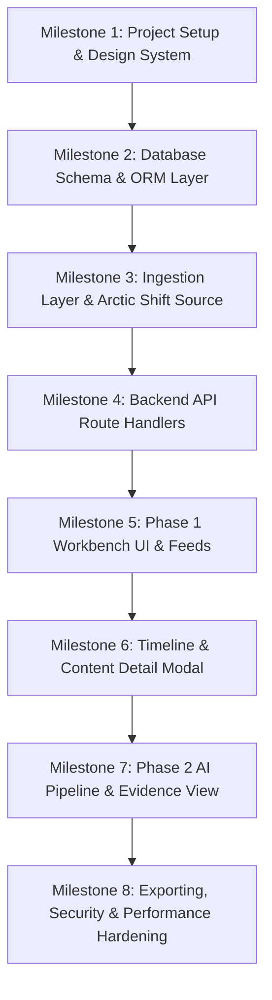

# Reddit Hidden Profile Viewer — Detailed Implementation Plan

## 1. Implementation Principles & Strategy

- **Phase Isolation**: Build and verify Phase 1 (Historical Viewer) before activating Phase 2 (AI Profiling).
- **Design Fidelity**: Faithfully translate Stitch *Forensic Archive* tokens (typography, 1px borders, semantic status pills, dark/AMOLED/light themes) into modular React components.
- **Zero Mocking in Production**: Implement a robust `IRedditDataSource` that connects directly to live Arctic Shift historical endpoints.
- **Zero Hallucination in AI**: Every insight generated in Phase 2 must strictly link to verified primary records stored in the database.

---

## 2. Step-by-Step Implementation Roadmap



---

### Milestone 1: Foundational Setup & Design System Setup
- **Target Deliverables**:
  - Initialize Next.js (App Router, TypeScript, Tailwind CSS).
  - Configure `tailwind.config.ts` with all Stitch design tokens from [`stitch-import/DESIGN.md`](file:///d:/Reddit-Hidden-Profile-Viewer/stitch-import/DESIGN.md) (`surface`, `surface-container-*`, `primary: #FFB598`, `secondary: #AAC7FF`, `outline: #30363D`).
  - Configure Google Fonts (`Inter` and `JetBrains Mono`) and Material Symbols Outlined icons.
  - Implement `ThemeProvider` supporting `.dark` (default), `.amoled` (`#000000`), and `.light` (`#F5F5F5`) modes with `localStorage` persistence.
  - Create the root layout with sticky `TopNavBar`, `WorkbenchSidebar`, and footer (`"Made by Ojasva Tiwari"`).

---

### Milestone 2: PostgreSQL Database & Data Access Layer
- **Target Deliverables**:
  - Setup database connection (Prisma / Drizzle ORM or Kysely for PostgreSQL).
  - Create database migrations matching [`docs/DATABASE_SCHEMA.md`](file:///d:/Reddit-Hidden-Profile-Viewer/docs/DATABASE_SCHEMA.md):
    - Tables: `users`, `subreddits`, `posts`, `comments`, `provenance_metadata`, `media_references`, `activity_aggregates`, `ai_insights`, `evidence_links`.
    - Enums: `content_status`, `media_status`, `confidence_level`, `claim_classification`, `sync_status`.
    - GIN full-text indexes and compound time-series indexes.
  - Implement repository functions for profile lookups, content search, and aggregation queries.

---

### Milestone 3: Ingestion Engine & Data Source Abstraction
- **Target Deliverables**:
  - Create `IRedditDataSource` contract in `src/lib/datasource/types.ts`.
  - Implement `ArcticShiftSource` with:
    - User submissions search (`/reddit/submission/search/`).
    - User comments search (`/reddit/comment/search/`).
    - Automatic pagination and chunking for active accounts.
    - Status inference (`VISIBLE`, `DELETED`, `REMOVED`, `EDITED`).
    - Sliding window rate limiting, exponential backoff, and network timeout protection.
  - Ingestion orchestrator that normalizes records, computes activity aggregates, and writes to PostgreSQL.

---

### Milestone 4: Backend API Route Handlers
- **Target Deliverables**:
  - `GET /api/search/user`
  - `GET /api/profile/[username]`
  - `GET /api/profile/[username]/posts`
  - `GET /api/profile/[username]/comments`
  - `GET /api/profile/[username]/activity`
  - `GET /api/profile/[username]/timeline`
  - `GET /api/content/[id]`
  - Standardized error handling, input validation (Zod), and query caching.

---

### Milestone 5: Phase 1 Workbench UI (Screens 1, 2, 3, 4)
- **Target Deliverables**:
  - **Landing Page (`/`)**: High-contrast username search interface with quick examples.
  - **Profile Overview (`/u/[username]`)** *(Screen 1)*: Account metrics card, sync status badge, high-level summary.
  - **Posts Feed (`/u/[username]/posts`)** *(Screen 2)*: Filterable post stream, search input, status pills (`DELETED`, `REMOVED`, `EDITED`), engagement badges.
  - **Activity Overview (`/u/[username]/activity`)** *(Screen 3)*: Subreddit distribution chart, hourly activity matrix, yearly trend line.
  - **Comments Feed (`/u/[username]/comments`)** *(Screen 4)*: Nested comment context cards, parent reference snippets, score badges.

---

### Milestone 6: Provenance, Timeline & Content Detail (Screens 5, 6)
- **Target Deliverables**:
  - **Timeline Stream (`/u/[username]/timeline`)** *(Screen 5)*: Chronological activity timeline with yearly milestone dividers and status indicators.
  - **Content Detail Modal** *(Screen 6)*: Reusable modal displaying side-by-side or unified diffs, provenance audit logs, and raw JSON payload inspector.
  - **Data Export Feature**: Client-side structured JSON and CSV generator for posts, comments, and activity metrics.

---

### Milestone 7: Phase 2 AI Profile Summary & Evidence View (Screens 7, 8)
- **Target Deliverables**:
  - Evidence Extraction Engine: Pre-processes top user contributions and formats structured inputs.
  - Gemini API Integration: Generates strictly 30 profile insights categorized into Demographics, Skills, Habits, Behavioral Patterns, and Contradictions.
  - Integrity Validator: Rejects any insight without valid local database evidence IDs.
  - **AI Profile Summary Page (`/u/[username]/ai-summary`)** *(Screen 8)*: "30 Things About This Profile" interactive cards with classification tags (`EXPLICIT`, `STRONGLY_SUPPORTED`, `WEAK_INFERENCE`) and confidence meters.
  - **Evidence View Modal** *(Screen 7)*: Interactive modal displaying the exact post/comment quote and timestamp supporting an insight.

---

### Milestone 8: Performance, Security & Launch Verification
- **Target Deliverables**:
  - Virtualized list rendering for users with >5,000 comments/posts.
  - DOMPurify HTML sanitization for Reddit markdown bodies.
  - Security review (SSRF protection on media endpoints, rate-limiting on search and AI routes).
  - Responsive audit across desktop (1280px+), tablet, and mobile viewports.
  - AMOLED and Light mode visual validation against Stitch design tokens.

---

## 3. Dependency Plan

```json
{
  "dependencies": {
    "next": "^14.2.0",
    "react": "^18.3.0",
    "react-dom": "^18.3.0",
    "@google/genai": "^0.1.1",
    "@tanstack/react-query": "^5.28.0",
    "pg": "^8.11.3",
    "drizzle-orm": "^0.30.0",
    "zod": "^3.22.4",
    "clsx": "^2.1.0",
    "tailwind-merge": "^2.2.2",
    "isomorphic-dompurify": "^2.9.0",
    "lucide-react": "^0.363.0"
  },
  "devDependencies": {
    "typescript": "^5.4.0",
    "@types/node": "^20.11.0",
    "@types/react": "^18.2.0",
    "@types/pg": "^8.11.0",
    "tailwindcss": "^3.4.1",
    "postcss": "^8.4.35",
    "autoprefixer": "^10.4.18",
    "drizzle-kit": "^0.20.14"
  }
}
```
